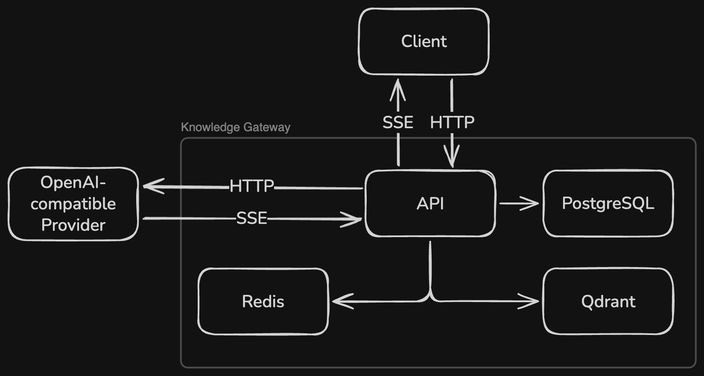
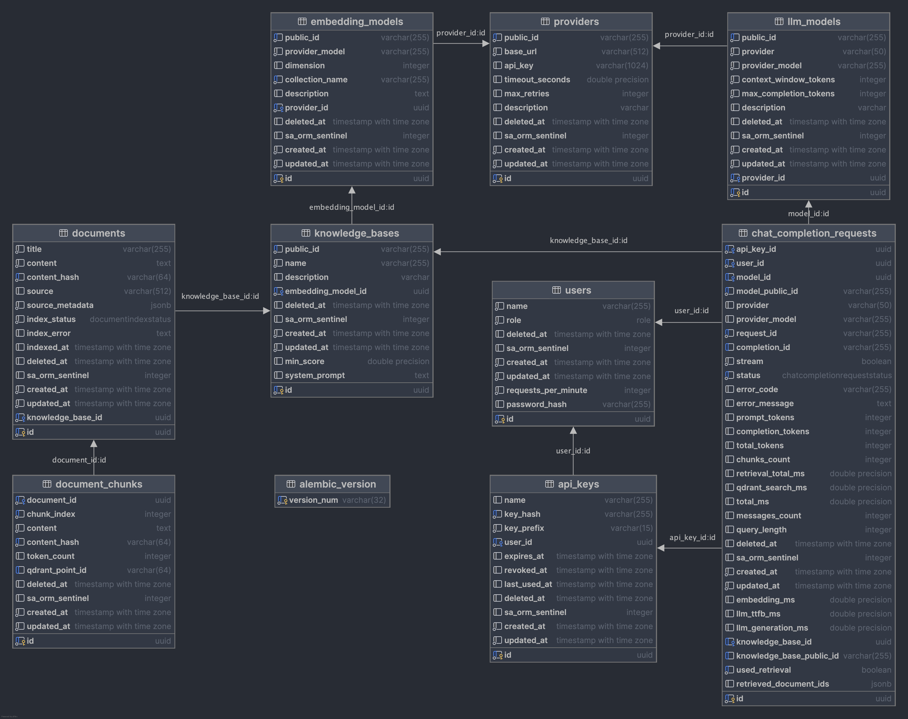
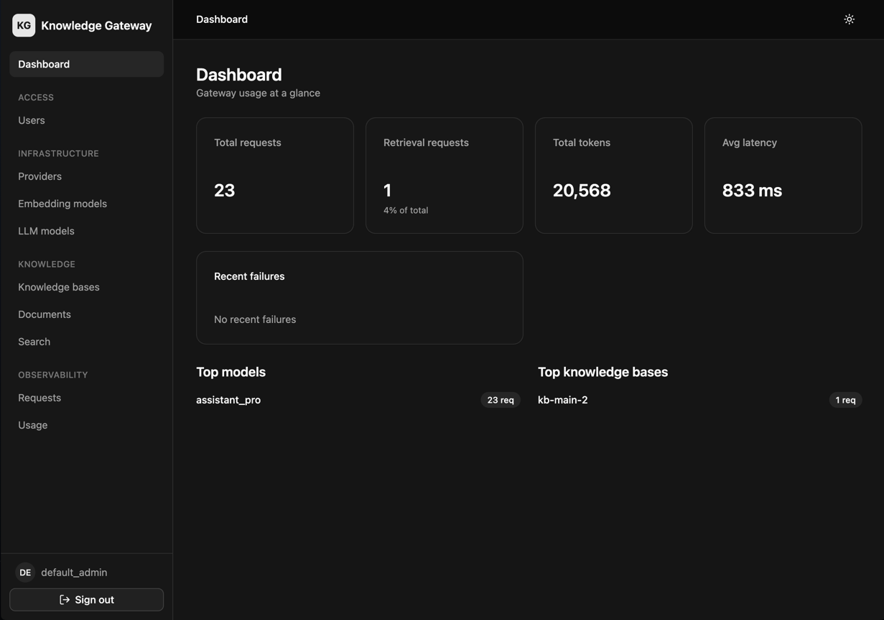

<div align="center">

# Knowledge Gateway

> A private LLM gateway with retrieval-augmented generation. OpenAI-compatible API, vector search
> over your documents, and per-user rate limiting — all self-hosted.

[](https://github.com/laviprog/knowledge-gateway/actions/workflows/tests.yml)
[](https://github.com/laviprog/knowledge-gateway/actions/workflows/lint.yml)
[](https://github.com/laviprog/knowledge-gateway/actions/workflows/typecheck.yml)
[](https://github.com/laviprog/knowledge-gateway/actions/workflows/admin.yml)
[](https://htmlpreview.github.io/?https://github.com/laviprog/knowledge-gateway/blob/python-coverage-comment-action-data/htmlcov/index.html)


</div>

Knowledge Gateway sits between your applications and any OpenAI-compatible LLM provider (OpenAI,
Azure OpenAI, vLLM, Ollama, …). Applications talk to it with the standard OpenAI SDK; the gateway
adds document retrieval (RAG) over isolated knowledge bases, per-user API keys and rate limits,
usage analytics, and a web admin panel — while keeping all data on your own infrastructure.

## Table of Contents

- [Features](#features)
- [Architecture](#architecture)
- [Quick Start](#quick-start)
- [Usage](#usage)
- [How Retrieval Works](#how-retrieval-works)
- [Admin Panel](#admin-panel)
- [API Overview](#api-overview)
- [Configuration](#configuration)
- [Development](#development)
- [Observability](#observability)
- [Project Structure](#project-structure)
- [License](#license)

## Features

- **OpenAI-compatible API** — `POST /chat/completions` (streaming and non-streaming) and
  `GET /models`. Any OpenAI SDK or client works out of the box; errors come back in the standard
  `{"error": {...}}` envelope.
- **Retrieval-augmented generation** — upload text / PDF / DOCX documents into knowledge bases;
  the gateway chunks, embeds, and indexes them in Qdrant, then injects relevant context into chat
  requests.
- **Multiple knowledge bases** — each knowledge base is bound to an embedding model and isolated
  from the others; a chat request selects one per call (or none for plain LLM proxying). Per-KB
  overrides for the system prompt and minimum similarity score.
- **Multiple providers and models** — providers, embedding models, and LLM models are database
  records managed at runtime, so different models can target different endpoints. Provider API
  keys are encrypted at rest.
- **Users, API keys, rate limiting** — API keys are stored only as HMAC-SHA256 hashes; per-user
  requests-per-minute limits are enforced via a Redis sliding window (fail-open on Redis outage).
- **Usage analytics** — every completion is logged with token counts and latency breakdown
  (embedding, vector search, LLM TTFB / generation). Message content is never persisted.
- **Admin panel** — React SPA for managing users, keys, documents, models, and viewing analytics,
  with cookie-session authentication.
- **Observability** — Prometheus metrics, structured JSON logs, and an optional
  Prometheus + Loki + Grafana stack with a pre-provisioned dashboard.

## Architecture



The API is a FastAPI application backed by three stores:

- **PostgreSQL** — relational data: users, API keys, providers, models, knowledge bases,
  documents, request logs.
- **Qdrant** — document chunk vectors. Each embedding model owns a collection; knowledge bases
  sharing an embedding model share its collection and are isolated by a payload filter.
- **Redis** — rate-limit counters and admin panel sessions.

LLM inference and embeddings go to any OpenAI-compatible provider over HTTP/SSE via the OpenAI
SDK. Chat responses stream back to the client as server-sent events.

### Data model



The key chain: an inference **provider** (base URL + encrypted API key) serves **embedding
models** and **LLM models**; a **knowledge base** is bound to one embedding model; **documents**
belong to a knowledge base. Chat requests reference an LLM model and, optionally, a knowledge
base, and every request produces a **chat completion request log** row.

## Quick Start

Requirements: Docker with the Compose plugin.

```bash
git clone https://github.com/laviprog/knowledge-gateway.git
cd knowledge-gateway

cp .env.example .env
# Set at least: API_KEY_PEPPER, PROVIDER_SECRET_KEY, QDRANT_API_KEY,
# POSTGRES_PASSWORD, BOOTSTRAP_ADMIN_API_KEY, BOOTSTRAP_ADMIN_PASSWORD

make build
make up
```

Compose runs database migrations automatically before starting the API. On first startup the
gateway creates a default admin user with the API key and password from
`BOOTSTRAP_ADMIN_API_KEY` / `BOOTSTRAP_ADMIN_PASSWORD`.

| Service     | URL                            |
|-------------|--------------------------------|
| API         | `http://127.0.0.1:8080/api/v1` |
| Admin panel | `http://127.0.0.1:8090`        |
| API docs    | `http://127.0.0.1:8080/api/v1/docs` (Scalar, `ENV=dev` only) |

### First-launch setup

There are no built-in defaults for providers or models — configure them once via the admin panel
(or the admin API), in this order:

1. **Provider** — base URL and API key of an OpenAI-compatible endpoint.
2. **Embedding model** — model name + vector dimension; owns a Qdrant collection.
3. **Knowledge base** — bound to an embedding model; optional per-KB system prompt and
   `min_score`.
4. **LLM model** — chat model exposed to clients under a `public_id`.
5. **Upload documents** into the knowledge base (text / PDF / DOCX) — indexing runs in the
   background.
6. **Create a user and API key** for your application.

## Usage

The gateway speaks the OpenAI protocol, so use any OpenAI SDK with a custom `base_url`. The only
extension is the optional `knowledge_base` / `knowledge_base_id` field (passed via `extra_body`),
which selects the knowledge base for retrieval. Omit it to proxy the request without RAG.

```python
from openai import OpenAI

client = OpenAI(
    base_url="http://127.0.0.1:8080/api/v1",
    api_key="<your-gateway-api-key>",
)

response = client.chat.completions.create(
    model="my-model",  # public_id of an LLM model registered in the gateway
    messages=[{"role": "user", "content": "What does our refund policy say?"}],
    extra_body={"knowledge_base": "support-docs"},  # knowledge base public_id
)

print(response.choices[0].message.content)
```

Streaming works the same way — pass `stream=True` and consume the chunks. With plain HTTP:

```bash
curl http://127.0.0.1:8080/api/v1/chat/completions \
  -H "Authorization: Bearer <your-gateway-api-key>" \
  -H "Content-Type: application/json" \
  -d '{
    "model": "my-model",
    "messages": [{"role": "user", "content": "Hello!"}],
    "knowledge_base": "support-docs",
    "stream": true
  }'
```

## How Retrieval Works

When a request specifies a knowledge base, the gateway:

1. Embeds the last user message with the knowledge base's embedding model.
2. Searches the embedding model's Qdrant collection, filtered by the knowledge base id, keeping
   up to `RAG_RETRIEVAL_LIMIT` chunks above the minimum score (global `RAG_MIN_SCORE` or the
   knowledge base's own `min_score`).
3. Builds a prompt from the system instruction (global `RAG_SYSTEM_INSTRUCTION` or the knowledge
   base's `system_prompt`) and up to `RAG_CONTEXT_MAX_CHARS` of retrieved context.
4. Calls the LLM model's provider and returns the completion, recording retrieval and generation
   latency in the request log.

Documents are converted with MarkItDown, split into overlapping chunks
(`DOCUMENT_CHUNK_MAX_CHARS` / `DOCUMENT_CHUNK_OVERLAP_CHARS`), embedded, and indexed in the
background after upload.

## Admin Panel

A React SPA (Vite + Refine + shadcn/ui) served at `http://127.0.0.1:8090`, authenticated with
Redis-backed sessions in an httpOnly cookie. Sign in with the bootstrap admin name and
`BOOTSTRAP_ADMIN_PASSWORD`. It covers users, API keys, providers, embedding and LLM models,
knowledge bases, document upload, and request analytics with per-model and per-knowledge-base
breakdowns. See [admin/README.md](admin/README.md) for frontend development.



## API Overview

All routes are served under `ROOT_PATH` (default `/api/v1`) and authenticated with
`Authorization: Bearer <api-key>`. Admin routes require a key with the admin role; they are
hidden from the OpenAPI schema when `ENV=prod` but remain functional.

**Public (any valid API key):**

| Endpoint                 | Description                                        |
|--------------------------|----------------------------------------------------|
| `POST /chat/completions` | OpenAI-compatible chat completion (SSE streaming supported) |
| `GET /models`            | OpenAI-compatible list of available LLM models     |

**Admin:**

| Endpoint group                          | Description                                   |
|-----------------------------------------|-----------------------------------------------|
| `/users`, `/api-keys`                   | Users, per-user rate limits, API key issuance/revocation |
| `/providers`                            | Inference providers (base URL, encrypted API key) |
| `/embedding-models`, `/llm-models`      | Model records bound to providers              |
| `/knowledge-bases`                      | Knowledge bases with per-KB RAG overrides     |
| `/documents`                            | Upload, list, search, delete documents        |
| `/chat-completion-requests`, `…/stats`  | Usage logs and aggregated analytics           |
| `/auth`                                 | Admin panel session login/logout              |

Interactive docs (Scalar) are available at `/api/v1/docs` when `ENV=dev`. Ready-made request
collections for [Bruno](https://www.usebruno.com/) live in [bruno/](bruno).

## Configuration

Everything is configured through environment variables (or `.env`); see
[.env.example](.env.example) for a complete template.

| Variable | Default | Description |
|----------|---------|-------------|
| `ENV` | `dev` | `dev` exposes API docs and admin routes in the schema; use `prod` in production |
| `LOG_LEVEL` | `DEBUG` | Logging level |
| `ROOT_PATH` | `/api/v1` | API root path |
| `API_KEY_PEPPER` | — **(required)** | Server-side pepper for hashing API keys |
| `API_KEY_DEFAULT_PREFIX` | `kg` | Prefix for generated API keys |
| `PROVIDER_SECRET_KEY` | — | Key for encrypting provider API keys at rest (required once a provider stores a key) |
| `TRUSTED_PROXY_IPS` | empty | Reverse-proxy IPs allowed to set `X-Forwarded-For` |
| `POSTGRES_HOST` / `PORT` / `DB` / `USER` / `PASSWORD` | — **(required)** | PostgreSQL connection |
| `QDRANT_URL`, `QDRANT_API_KEY` | — **(required)** | Qdrant connection |
| `REDIS_URL` | `redis://localhost:6379` | Redis for rate limiting and sessions |
| `RATE_LIMIT_DEFAULT_REQUESTS_PER_MINUTE` | `60` | Default per-user limit (`0` = unlimited) |
| `BOOTSTRAP_ADMIN_NAME` | `default_admin` | Default admin user name |
| `BOOTSTRAP_ADMIN_API_KEY` | — | Admin API key created on first startup |
| `BOOTSTRAP_ADMIN_PASSWORD` | — | Admin panel password; unset disables password login |
| `SESSION_COOKIE_NAME` / `TTL_SECONDS` / `SECURE` / `SAMESITE` | see `.env.example` | Admin session cookie settings (`SESSION_COOKIE_SECURE=false` for local HTTP) |
| `DOCUMENT_UPLOAD_MAX_BYTES` | `10485760` | Max upload size (10 MB) |
| `DOCUMENT_CHUNK_MAX_CHARS` | `2500` | Chunk size |
| `DOCUMENT_CHUNK_OVERLAP_CHARS` | `250` | Chunk overlap |
| `RAG_RETRIEVAL_LIMIT` | `10` | Max chunks retrieved per request |
| `RAG_CONTEXT_MAX_CHARS` | `12000` | Max characters of retrieved context in the prompt |
| `RAG_MIN_SCORE` | unset | Global minimum similarity score (overridable per knowledge base) |
| `RAG_SYSTEM_INSTRUCTION` | built-in | Default RAG system prompt (overridable per knowledge base) |
| `GRAFANA_ADMIN_USER` / `PASSWORD` | `admin` | Grafana credentials (monitoring profile only) |

## Development

Requirements: Python 3.12+, [uv](https://docs.astral.sh/uv/), Docker (for infrastructure).

```bash
make setup      # uv sync --all-groups
make hooks      # install pre-commit hooks (ruff, ty, pytest)

make test       # run the test suite
make coverage   # tests with coverage report
make check      # ruff check + format check + ty type check
make format     # auto-fix and format

make migrate    # apply Alembic migrations to a local database
```

Run a single test:

```bash
uv run pytest tests/redis/test_rate_limiter.py -v
```

The codebase follows a vertical-slice layout: each domain under
`src/knowledge_gateway/<domain>/` has its own `routes.py`, `services.py`, `repositories.py`,
`models.py`, and `schema.py`. Linting and formatting use ruff (line length 100), type checking
uses [ty](https://github.com/astral-sh/ty) with warnings treated as errors — CI runs all three
plus pytest on every push.

For the admin panel, run the backend locally with `SESSION_COOKIE_SECURE=false` and start the
frontend dev server with `npm run dev` in [admin/](admin) — it proxies `/api` to the backend.

## Observability

```bash
make monitoring-up    # app + Prometheus, Loki, Promtail, Grafana
make monitoring-down
```

- **Metrics** — Prometheus endpoint at `GET /metrics`: HTTP RED metrics plus custom
  chat/RAG/provider collectors.
- **Logs** — structured JSON logs (structlog) with request correlation ids, shipped to Loki by
  Promtail.
- **Dashboards** — Grafana at `http://127.0.0.1:3000`, auto-provisioned with datasources and an
  overview dashboard.
- **Business analytics** — DB-backed usage stats at `GET /chat-completion-requests/stats`
  (tokens, average latencies, per-model and per-knowledge-base breakdowns), independent of the
  monitoring stack.

## Project Structure

```
├── src/knowledge_gateway/   # FastAPI application (vertical-slice domains)
│   ├── chats/               # OpenAI-compatible completions, RAG orchestration, usage logs
│   ├── documents/           # upload, extraction, chunking, background indexing
│   ├── knowledge_bases/     # knowledge base management
│   ├── providers/           # inference providers (encrypted API keys)
│   ├── embedding_models/    # embedding models (own Qdrant collections)
│   ├── llm_models/          # LLM model records + public /models endpoint
│   ├── users/, api_keys/    # users, hashed API keys, rate limits
│   ├── auth/, security/     # admin sessions, key hashing, encryption
│   └── llm/, qdrant/, redis/  # infrastructure clients
├── admin/                   # React admin panel (Vite + Refine + shadcn/ui)
├── migrations/              # Alembic migrations
├── docker/                  # Dockerfiles + Prometheus/Loki/Grafana configs
├── bruno/                   # Bruno API request collections
└── tests/                   # pytest suite mirroring src/
```

## License

This project is licensed under the MIT License. See [LICENSE](LICENSE).
